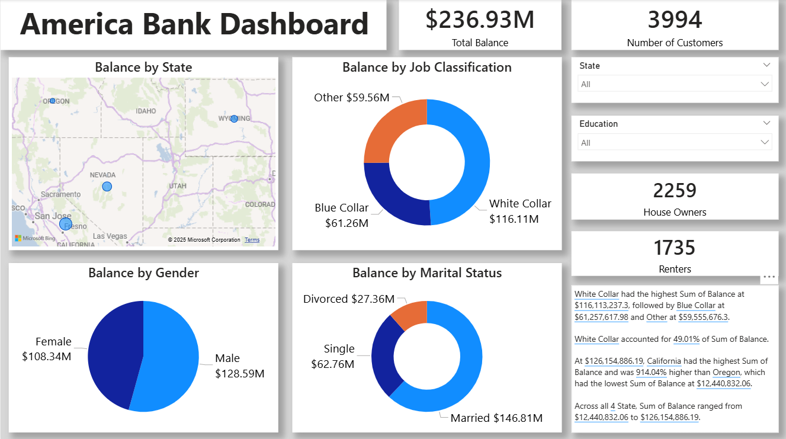

# 🇺🇸 America Bank Dashboard
An interactive Power BI dashboard that provides a comprehensive analysis of banking customer data across various demographic and regional segments.

---

## 📊 Dashboard Highlights

- **💰 Total Balance**: $236.93M  
- **👥 Total Customers**: 3,994  
- **🏠 House Owners**: 2,259  
- **🏢 Renters**: 1,735  

---

## 📂 Visuals and Insights

### 🌍 Balance by State
- Interactive map showing balance distribution across U.S. states
- **California** recorded the highest sum at **$126.15M**
- **Oregon** had the lowest at **$12.44M**

### 👔 Balance by Job Classification
- **White Collar**: $116.11M (49.01% of total)
- **Blue Collar**: $61.26M  
- **Other**: $59.56M

### 👨‍👩‍👧 Balance by Gender
- **Male**: $128.59M  
- **Female**: $108.34M

### 💍 Balance by Marital Status
- **Married**: $146.81M  
- **Single**: $62.76M  
- **Divorced**: $27.36M

---

## 🎯 Filters

- Filter by **State**
- Filter by **Education Level**

These filters allow users to drill down into specific regions or customer segments for deeper insights.

---

## 🛠 Technologies Used

- **Power BI** – Data modeling and interactive dashboard creation  
- **Microsoft Bing Maps** – Location-based visualization  
- Chart Types: Donut, Pie, Card KPIs, Map visuals  

---

## 🧠 Key Insights

- **White Collar** professionals contribute nearly **half** of the total balance  
- **Married** customers dominate with **$146.81M** in total balance  
- **California** holds the highest balance with a **914.04% increase** over Oregon  
- **Male customers** hold a slightly higher balance compared to female customers  

---

## 🗂 Project Structure

